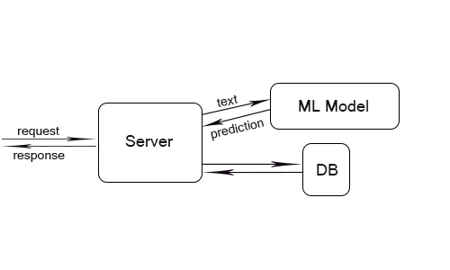
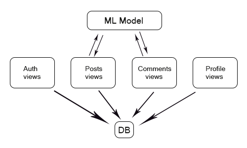

# Null++ NLP

## Description
In the era when everything is online we often stumble upon offensive language that might worsen our day or impact our brand. This is the problem we tackle with.

We figured out that a good example will serve a blog website, where the majority of the content is in plain text. Here, posting an offensive article or comment might impact some users. So it is important for an owner of such a blog to be able to filter those.

This is were NLP comes in. We trained a model that will predict if an article or comment is offensive, so that the server can take actions based on the model's output.

## How to run
### Setup
1. Clone this repository.
2. Ensure you have django installed. If not: `pip install django`.
3. Head into the *null_blog* folder. It is where the website lives.
4. Run the server with `py manage.py runserver` for Windows or an equivalent on your OS.
5. Access the website on __http://localhost:8000/__ or __http://127.0.0.1:8000/__ in a browser.

*Note:* The application starts with some articles in the database to work with. If you want to start with an empty database do the following:
- remove the *db.sqlite3* file from the *null_blog* folder.
- execute this command: `py manage.py migrate`
- run the server: `py manage.py runserver`
- access the website on __http://localhost:8000/__ or __http://127.0.0.1:8000/__ in a browser.

### What to do with the website
To test the model you can create an article or comment. If the content is offensive, the website will not allow you to publish it.

## Project Structure
Our project has the following structure:
 

## Model
We use a __Logistic Regression__ model to classify an offensive or an ordinary text content.

### Preprocessing
For the preprocessing we created the __TextTransformer__ class. Take a look at it here: 

### Dataset
You can find the dataset [here](https://www.kaggle.com/mrinaal007/hate-speech-detection).

## Backend
### A quick introduction to django
Django is a web framework created to be fast in development, secure and scalable.

The most important part of the code is in the *views.py* file, which describes the behaviour of the whole website. Simply put, views are functions called when a client makes a request to a specific URL path. Other important files are *urls.py*, *models.py*, *forms.py*. In this project they are standard.

Django uses *Server-Side Rendering*, meaning that the HTML is created dynamicaly on the server using a template system. It is then sent as a response to the client. The client's web browser interprets the HTML from the server's response into what we understand as a web page.

### Our backend's architecture
This is the architecture of the django backend:
 

 
As you can see only the post and comment views are working with the ML model. The model is called at a POST request to these views (when creating posts and comments).

### Adding the model
To integrate the model into the django backed we created a dedicated folder for our model named *model* in the *blog* folder. It contains a pickle of the model, a file called *nlp_model.py* and a file called *preprocessing.py*.

The *nlp_model.py* file is responsible for unpacking the model from pickle and exporting a function that predicts whether a given text is offensive or not. This function uses a *transformer*. The *transformer* here is an instance of __TextTransformer__ class declared in the *preprocessing.py* file.